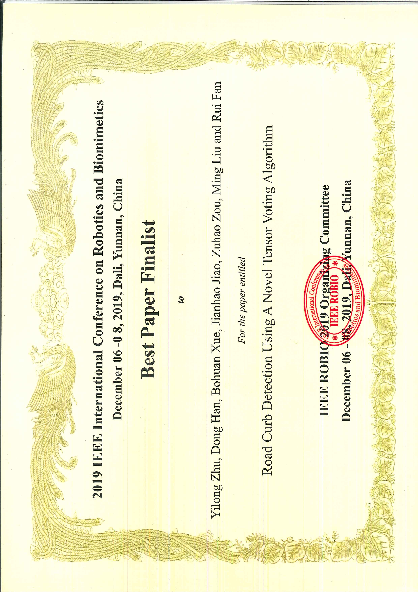

## About

Rui (Ranger) FAN was born in Inner Mongolia, China in 1993. He received his BEng degree in Automation (Control Science and Engineering) from <a href="https://en.wikipedia.org/wiki/Harbin_Institute_of_Technology">the Harbin Institute of Technology (HIT)</a> in July 2015. Between September 2015 and June 2018, Rui worked towards his Ph.D. degree with <a href="https://en.wikipedia.org/wiki/John_Rarity">Prof. John G. Rarity</a> and <a href="https://research-information.bris.ac.uk/en/persons/naim-dahnoun(b0315f4f-9fdc-4002-9202-dbe2fb679818).html">Dr. Naim Dahnoun</a> in <a href="https://vilab.blogs.bristol.ac.uk/">the Visual Information Lab</a> in the Department of Electrical & Electronic Engineering at <a href="https://www.bristol.ac.uk/">the University of Bristol (UoB)</a>. From July 2018 to February 2020, Rui worked as a Research Associate (Postdoc) with <a href="https://www.ece.ust.hk/eelium">Prof. Ming Liu</a> in <a href="https://www.ram-lab.com/">the Robotics and Multi-Perception Laboratory (RAM-Lab)</a> in <a href="http://ri.ust.hk/">the Robotics Institute (RI)</a> at <a href="https://www.ust.hk/home">the Hong Kong University of Science and Technology (HKUST)</a>. Since February 2020, Rui has been working as a Postdoc Fellow with <a href="https://profiles.ucsd.edu/linda.zangwill">Prof. Linda Zangwill</a> and <a href="https://cseweb.ucsd.edu/~kriegman/">Prof. David J. Kriegman</a> in <a href="https://shileyeye.ucsd.edu/">the Department of Ophthalmology</a> as well as <a href="https://cse.ucsd.edu/">the Department of Computer Science and Engineering</a> at <a href="https://ucsd.edu/">the University of California, San Diego (UCSD)</a>. Furthermore, Rui is also the co-founder and chief scientist of Hangzhou ATG Intelligent Technology Co. Ltd. Rui’s research interests include computer vision, image/signal processing, and deep learning. 
 
Email: [rui.fan@ieee.org](mailto:rui.fan@ieee.org)

----
****
## <a name="featured_publications">Featured Publications</a>
----
### * SNE-RoadSeg: Incorporating Surface Normal Information into Semantic Segmentation for Accurate Freespace Detection

<iframe width="500" height="281" src="https://www.youtube.com/embed/wWrZhDuh6xc" frameborder="0" allow="accelerometer; autoplay; encrypted-media; gyroscope; picture-in-picture" allowfullscreen></iframe>

In this project, we proposed a novel freespace detection approach, referred to as SNE-RoadSeg [1], based on data-fusion semantic driving scene segmentation. Our main contributions include: 1) surface normal estimator (SNE), a novel module capable of inferring surface normal information from dense disparity (or inverse depth) images with high accuracy and efficiency; 2) RoadSeg, a data-fusion CNN architecture capable of extracting and fusing features from both RGB images and the inferred surface normal information; and 3) Ready-to-Drive (R2D), a large-scale synthetic freespace detection dataset (containing 11430 pairs of stereo images and their corresponding depth images and semantic segmentation ground truth), collected under different illumination and weather conditions. 
 
[1] **Fan, R.**, Wang, H.*, Cai, P., and Liu, M., 2020. SNE-RoadSeg: Incorporating Surface Normal Information into Semantic Segmentation for Accurate Freespace Detection. _In Proceedings of the **European Conference on Computer Vision (ECCV)**. [[paper]()][[code](https://sites.google.com/view/sne-roadseg/code?authuser=0)][[video](https://www.youtube.com/watch?v=wWrZhDuh6xc)][[dataset](https://sites.google.com/view/sne-roadseg/dataset?authuser=0)][[results](http://m.cvlibs.net/datasets/kitti/eval_road_detail.php?result=bed2008b97d76d5defb08a5930eadbe461483dd1)]

----
### * Pothole Detection Based on Disparity Transformation and Road Surface Modeling

In this project, we developed a robust road pothole detection algorithm [1] based on novel disparity transformation [2] and road surface modeling. Firstly, we utilized our previously published disparity estimation algorithm (PT-SRP) to acquire dense road disparity maps and reconstruct the 3D road geometry. The original disparity maps were transformed to better distinguish between damaged and undamaged road areas. Then, the disparities in the undamaged road areas were modeled by a quadratic surface. By comparing the difference between the actual and modeled disparity maps, the potholes can be successfully detected. We created three datasets including 67 pairs of stereo road images using a ZED stereo camera. Please kindly cite our papers when using our datasets in your research. 
 
[1] **Fan, R.**, Ozgunalp, U., Hosking, B., Liu, M., and Pitas, I., 2020. Pothole Detection Based on Disparity Transformation and Road Surface Modeling. _**IEEE Transactions on Image Processing**_, 29(1), pp.897-908. [[paper](https://ieeexplore.ieee.org/abstract/document/8809907)][[arxiv](https://arxiv.org/pdf/1908.00894.pdf)][[datasets](https://github.com/ruirangerfan/stereo_pothole_datasets)]

[2] **Fan, R.**, Bocus, M. J., and Dahnoun, N., 2018. A novel disparity transformation algorithm for road segmentation. _**Information Processing Letters**_, 140, pp.18-24. [[paper](https://www.sciencedirect.com/science/article/abs/pii/S0020019018301583)][[arxiv](https://arxiv.org/pdf/1808.02837.pdf)]

----
### * Real-Time Dense Stereo Embedded in A UAV for Road Inspection

<iframe width="500" height="281" src="https://www.youtube.com/embed/_-YmlxojVMI" frameborder="0" allow="accelerometer; autoplay; encrypted-media; gyroscope; picture-in-picture" allowfullscreen></iframe>

In this project, we designed an efficient and accurate dense stereo vision system and embedded it in a DJI Matrice 100 drone for road inspection [1]. We mounted a ZED stereo camera on the drone to capture stereo road images. These images were then processed on an NVIDIA Jetson TX2 GPU. We created three datasets including 11368 pairs of stereo images. Please kindly cite our paper when using our datasets in your research. 
 
[1] **Fan, R.**, Jiao, J., Pan, J., Huang, H., Shen, S. and Liu, M., 2019. Real-Time Dense Stereo Embedded in A UAV for Road Inspection. In Proceedings of the _**IEEE Conference on Computer Vision and Pattern Recognition (CVPR) Workshops**_. [[paper](http://openaccess.thecvf.com/content_CVPRW_2019/papers/UAVision/Fan_Real-Time_Dense_Stereo_Embedded_in_a_UAV_for_Road_Inspection_CVPRW_2019_paper.pdf)][[video](https://youtu.be/_-YmlxojVMI)][[datasets](https://drive.google.com/file/d/1lEA-wawzHpsNdeIIKriaiHKZu2zyFSGP/view?usp=sharing)]

News: this road surface 3D reconstruction system has been reported by over ten international media agencies, such as [VentureBeat](https://venturebeat.com/2019/04/15/researchers-use-drones-to-detect-potholes-cracks-and-other-road-damage/), [Diamandis](https://www.diamandis.com/blog/abundance-insider-apr-19th-2019), [Drobots Company](https://drobotscompany.com/drones-detect-road-damage-drone-jobs-future/), [UAS Vision](https://www.uasvision.com/2019/04/17/researchers-use-ai-drones-to-detect-road-damage/), [Import AI](https://jack-clark.net/2019/04/22/import-ai-143-predicting-car-accident-risks-by-looking-at-the-houses-people-live-in-why-data-matters-as-much-as-compute-and-using-capsule-networks-to-generate-synthetic-data/), [Impact Lab](https://theusbreakingnews.com/researchers-use-drones-to-detect-potholes-cracks-and-other-road-damage/), [US Breaking News](https://theusbreakingnews.com/researchers-use-drones-to-detect-potholes-cracks-and-other-road-damage/), [PCNewsBuzz](https://www.pcnewsbuzz.com/2019/04/16/researchers-use-drones-to-detect-potholes-cracks-and-other-road-damage/) and [Engineering 360](https://insights.globalspec.com/article/11651/team-developing-ai-enabled-drones-for-pothole-crack-detection). (07/07/2019) 

----
### * Multiple Lane Detection Algorithm Based on Novel Dense Vanishing Point Estimation

<iframe width="500" height="281" src="https://www.youtube.com/embed/fgriUdy1kv0" frameborder="0" allow="accelerometer; autoplay; encrypted-media; gyroscope; picture-in-picture" allowfullscreen></iframe>

In this project, we proposed three robust multiple lane detection algorithms [1], [2] based on dense vanishing point estimation. Such vanishing points were estimated from dense disparity images using dynamic programming and least squares fitting [3]. The datasets we used are available on the KITTI benchmark. We will be happy if you cite us: 
 
[1] Ozgunalp, U., **Fan, R.**, Ai, X. and Dahnoun, N., 2016. Multiple lane detection algorithm based on novel dense vanishing point estimation. _**IEEE Transactions on Intelligent Transportation Systems**_, 18(3), pp.621-632. [[paper](https://ieeexplore.ieee.org/abstract/document/7534770/)][[video](https://www.youtube.com/watch?v=s0RiXMsgUc8)]

[2] **Fan, R.** and Dahnoun, N., 2018. Real-time stereo vision-based lane detection system. _**Measurement Science and Technology**_, 29(7), p.074005. [[paper](https://iopscience.iop.org/article/10.1088/1361-6501/aac163/meta)][[arxiv](https://arxiv.org/pdf/1807.02752.pdf)][[video](https://www.youtube.com/watch?v=45nu_9yE0Ws&list=PLSsD3AXVRPMWuMjiJqAm42Jlo8Zd2QG65)]

[3] Jiao, J., **Fan, R.**, Ma, H., Liu, M., 2019 Using DP Towards A Shortest Path Problem-Related Application, _**International Conference on Robotics and Automation (ICRA)**_, May 20-24,  Montreal, Canada. [[paper](https://ieeexplore.ieee.org/abstract/document/8793603/)][[arxiv](https://arxiv.org/pdf/1903.02765.pdf)][[video](https://www.youtube.com/watch?v=BiqJxLh_xdY)]

----
### * Road Surface 3D Reconstruction Based on Dense Subpixel Disparity Map Estimation

<iframe width="500" height="281" src="https://www.youtube.com/embed/pypPI7fsctg" frameborder="0" allow="accelerometer; autoplay; encrypted-media; gyroscope; picture-in-picture" allowfullscreen></iframe>

In this paper, we presented a dense subpixel disparity map estimation algorithm for road surface 3D reconstruction [1]. The main contributions include a perspective transformation algorithm as well as an efficient disparity estimation and refinement algorithm. We utilized a ZED stereo camera to create three datasets and made them publicly available for the research purposes. The datasets include 91 pairs of stereo road images. The videos recording our experimental results can be found on my YouTube playlists. Please kindly cite our paper when using our datasets in your research.  
 
[1] **Fan, R.**, Ai, X. and Dahnoun, N., 2018. Road surface 3D reconstruction based on dense subpixel disparity map estimation. _**IEEE Transactions on Image Processing**_, 27(6), pp.3025-3035. [[paper](https://ieeexplore.ieee.org/abstract/document/8300645)][[arxiv](https://arxiv.org/pdf/1807.01874.pdf)][[video](https://www.youtube.com/watch?v=pypPI7fsctg&list=PLSsD3AXVRPMXuK1PM-5OlhItgNEClCKB3)][[datasets](https://github.com/ruirangerfan/road_surface_3d_reconstruction_datasets)]

[<i class="fa fa-level-up"> Back to top</i>]()
## <a name="services">Services</a>
----
* [Innovation Program Chair of the 2019 IEEE International Conference on Imaging Systems and Techniques (IST)](https://ist2019.ieee-ims.org/organizers)
* Reviewer of the IEEE Transactions on Image Processing (TIP)
* Reviewer of the IEEE Transactions on Cybernetics (TCYB)
* Reviewer of the IEEE Transactions on Intelligent Transportation Systems (TITS)
* Reviewer of the IEEE Transactions on Intelligent Vehicles (TIV)
* Reviewer of the IEEE Transactions on Industrial Informatics (TII)
* Reviewer of the IEEE Signal Processing Magazine (SPM)
* Reviewer of the IEEE Robotics and Automation Letters (RAL)
* Reviewer of Ophthalmology
* Reviewer of the 2018 European Conference on Computer Vision (ECCV)
* Reviewer of the 2020 British Machine Vision Conference (BMVC)
* Reviewer of the 2019 IEEE Conference on Computer Vision and Pattern Recognition (CVPR) workshop
* Reviewer of the 2019 International Conference on Intelligent Robotics and Systems (IROS)
* Reviewer of the 2020 International Conference on Intelligent Robotics and Systems (IROS)
* Reviewer of the 2020 IEEE International Conference on Robotics and Automation (ICRA)
* Reviewer of the 2019 IEEE Intelligent Transportation Systems Conference (ITSC)
* [Reviewer of the 2020 IEEE Intelligent Transportation Systems Conference (ITSC)](https://www.ieee-itsc2020.org/wp-content/uploads/2020/05/List-of-Reviewers.pdf)
* Reviewer of the 2019 IEEE Intelligent Vehicles Symposium (IV)
* Reviewer of the 2020 IEEE Intelligent Vehicles Symposium (IV)
* Reviewer of the 2019 IEEE European Signal Processing Conference (EUSIPCO)

[<i class="fa fa-level-up"> Back to top</i>]()
## <a name="lectures_tutorials_seminars">Lectures, Tutorials & Seminars</a>
----
* Lectures for the [short course on deep learning & computer vision for autonomous systems](http://icarus.csd.auth.gr/dl-and-cv-for-autonomous-cars-2019/), in Thessaloniki, Greece, invited by [Prof. Ioannis Pitas](http://poseidon.csd.auth.gr/LAB_PEOPLE/IPitas.htm) (IEEE Fellow, IEEE Distinguished Lecturer, EURASIP Fellow). [08/26/2019-08/27/2019]
* Seminar ["We are driving on the road"](http://www.hitsz.edu.cn/article/view/id-65956.html) at the Harbin Institute of Technology, Shenzhen. [09/18/2019]

[<i class="fa fa-level-up"> Back to top</i>]()
## <a name="awards">Awards</a>
----

[<i class="fa fa-level-up"> Back to top</i>]()

