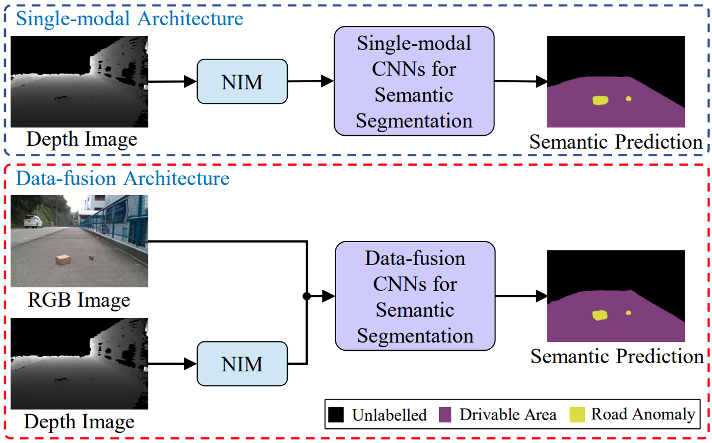
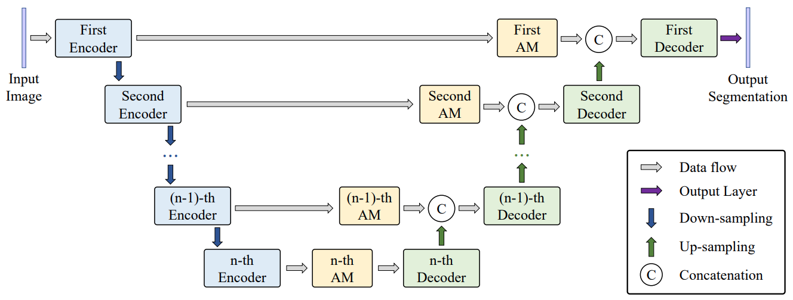
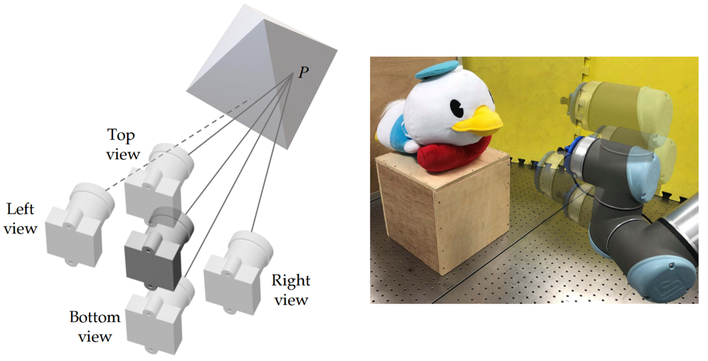
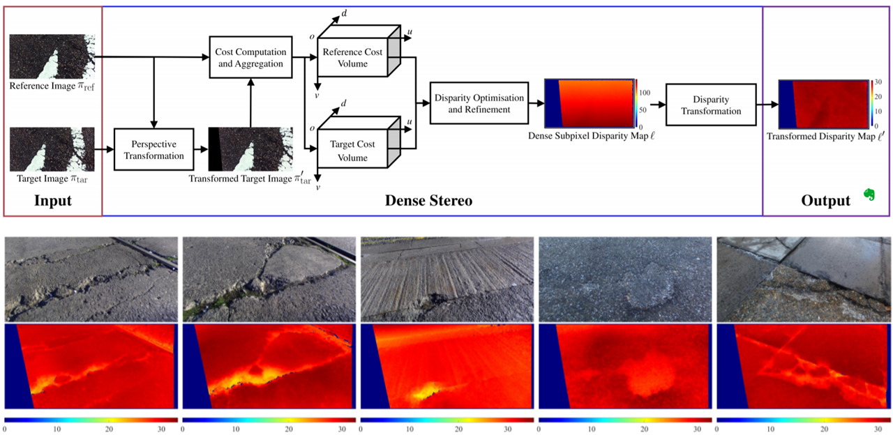
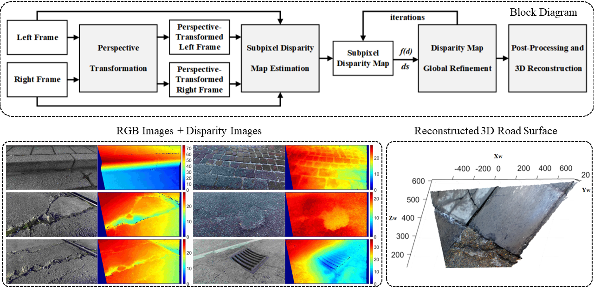
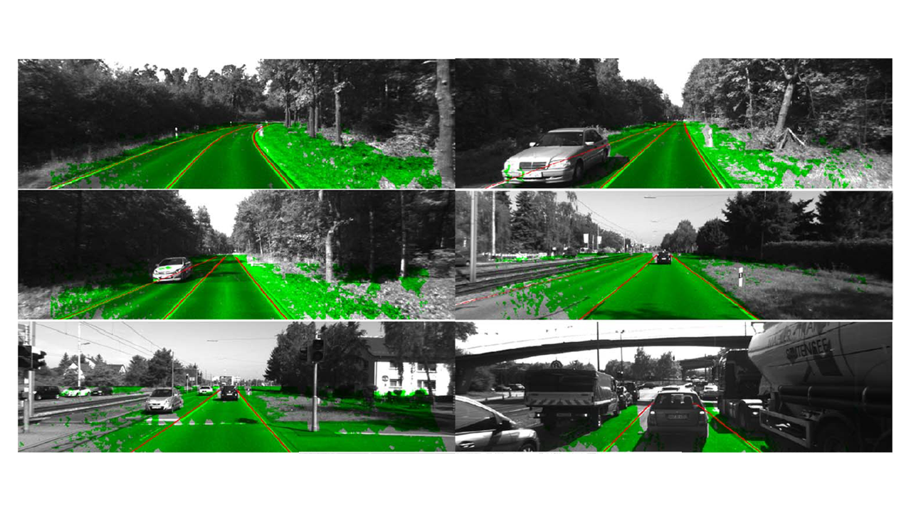

## <a name="about">About</a>

Rui (Ranger) FAN [范睿] was born in Inner Mongolia, China in 1993. Rui received his BEng degree in Automation (Control Science and Engineering) from <a href="https://en.wikipedia.org/wiki/Harbin_Institute_of_Technology">the Harbin Institute of Technology (HIT)</a> in July 2015. Between September 2015 and June 2018, Rui worked towards his Ph.D. degree with <a href="https://en.wikipedia.org/wiki/John_Rarity">Prof. John G. Rarity</a> and <a href="https://research-information.bris.ac.uk/en/persons/naim-dahnoun(b0315f4f-9fdc-4002-9202-dbe2fb679818).html">Prof. Naim Dahnoun</a> in <a href="https://vilab.blogs.bristol.ac.uk/">the Visual Information Laboratory (VILab)</a>, the Dept. of Electrical & Electronic Engineering, at <a href="https://www.bristol.ac.uk/">the University of Bristol (UoB)</a>. Rui's Ph.D. thesis title: ''<a href="https://research-information.bris.ac.uk/en/studentTheses/real-time-computer-stereo-vision-for-automotive-applications">Real-Time Computer Stereo Vision for Automotive Applications</a>''. 

 
 
From July 2018 to February 2020, Rui worked as a Research Associate (Postdoc) in <a href="http://ri.ust.hk/">the Robotics Institute (RI)</a>, as well as the Deputy Director of <a href="https://www.ram-lab.com/">the Robotics and Multi-Perception Laboratory (RAM-Lab)</a>, supervised by <a href="https://www.ece.ust.hk/eelium">Prof. Ming Liu</a>, at <a href="https://www.ust.hk/home">the Hong Kong University of Science and Technology (HKUST)</a>. Since February 2020, Rui has been working as a Postdoc Fellow with <a href="https://profiles.ucsd.edu/linda.zangwill">Prof. Linda Zangwill</a> and <a href="https://cseweb.ucsd.edu/~kriegman/">Prof. David J. Kriegman</a> in <a href="https://shileyeye.ucsd.edu/">the Dept. of Ophthalmology</a> and <a href="https://cse.ucsd.edu/">the Dept. of Computer Science & Engineering</a> at <a href="https://ucsd.edu/">the University of California, San Diego (UCSD)</a>. Rui co-founded <a href="http://www.atg-itech.com/">ATG Robotics</a> in July 2019 and has been their chief scientist since then. Rui is also the General Chair of <a href="https://avvision.xyz/">AVVision</a>. 

 
 

Rui will join <a href="https://cse.tongji.edu.cn/">the Dept. of Control Science & Engineering</a>, <a href="https://see.tongji.edu.cn/">the School of Electronic & Information Engineering</a>, and <a href="https://srias.tongji.edu.cn/">Shanghai Research Institute for Intelligent Autonomous Systems</a>, at <a href="https://en.wikipedia.org/wiki/Tongji_University">Tongji University</a>, as a Research Full Professor in Fall 2021. Rui has several Master/Ph.D./Postdoc openings.

 
 

Rui’s research interests include computer vision, robotics, image/signal processing, and machine/deep learning. 
 

## <a name="featured_publications">Featured Publications</a>

<table style="width:100%;border:0px;border-spacing:0px;border-collapse:separate;margin-right:auto;margin-left:auto;"><tbody>

<tr onmouseout="font_stop()" onmouseover="font_start()" bgcolor="">
<td style="padding:0px;padding-bottom: 0px;width:30%;vertical-align:middle">

</td>
<td style="padding:10px;padding-bottom: 0px;width:70%;vertical-align:top">
<papertitle>Conditional Link Prediction of Category-Implicit Keypoint Detection.</papertitle>
<em>WACV</em>, 2021. (Oral)
 
Yi-Ge, E., <strong>Fan, R.</strong>, Liu, Z. and Shen, Z.
 
<a href="https://arxiv.org/pdf/2011.14462.pdf"><i class="fa fa-file-pdf-o"></i> pdf</a> /
<a href="./bib/wacv2021_ge.html"><i class="fa fa-sticky-note-o"></i> bibtex</a> 
 

</td>
</tr>

<tr onmouseout="font_stop()" onmouseover="font_start()" bgcolor="">
<td style="padding:0px;padding-bottom: 0px;width:30%;vertical-align:middle">

</td>
<td style="padding:10px;padding-bottom: 0px;width:70%;vertical-align:top">
<papertitle>CoT-AMFlow: Adaptive Modulation Network with Co-Teaching Strategy for Unsupervised Optical Flow Estimation.</papertitle>
<em>CoRL</em>, 2020. (Acceptance rate: 34%)
 
Wang, H., <strong>Fan, R.</strong> and Liu, M.
 
<a href="https://arxiv.org/pdf/2011.02156.pdf"><i class="fa fa-file-pdf-o"></i> pdf</a> /
<a href="./bib/corl2020_wang.html"><i class="fa fa-sticky-note-o"></i> bibtex</a> /
<a href="https://sites.google.com/view/cot-amflow"><i class="fa fa-external-link"></i> webpage</a> /
<a href="https://github.com/hlwang1124/CoT-AMFlow"><i class="fa fa-github"></i> code</a> /
<a href="https://youtu.be/LzL7QZhwFjE"><i class="fa fa-film"></i> demo</a>
 

</td>
</tr>

<tr onmouseout="font_stop()" onmouseover="font_start()" bgcolor="">
<td style="padding:0px;padding-bottom: 0px;width:30%;vertical-align:middle">

</td>
<td style="padding:10px;padding-bottom: 0px;width:70%;vertical-align:top">
<papertitle>Loop-Box: Multiagent Direct SLAM Triggered by Single Loop Closure for Large-Scale Mapping.</papertitle>
 
<em>IEEE Trans on Cybernetics (T-Cyb)</em>, 2020. (IF: 11.079)
 
Bhutta, M.U.M., Kuse, M., <strong>Fan, R.</strong>, Liu, Y. and Liu, M.
 
<a href="./pdf/tcyb2020_usman.pdf"><i class="fa fa-file-pdf-o"></i> pdf</a> /
<a href="./bib/tcyb2020_usman.html"><i class="fa fa-sticky-note-o"></i> bibtex</a> /
<a href="https://www.youtube.com/watch?v=AatjVz5ysV8"><i class="fa fa-film"></i> demo</a>
 

</td>
</tr>

<tr onmouseout="font_stop()" onmouseover="font_start()" bgcolor="">
<td style="padding:0px;padding-bottom: 0px;width:30%;vertical-align:middle">

</td>
<td style="padding:10px;padding-bottom: 0px;width:70%;vertical-align:top">
<papertitle>Applying Surface Normal Information in Drivable Area and Road Anomaly Detection for Ground Mobile Robots.</papertitle>
<em>IROS</em>, 2020.
 
Wang, H.*, <strong>Fan, R.</strong>*, Sun, Y. and Liu, M.
 
<a href="https://arxiv.org/pdf/2008.11383.pdf"><i class="fa fa-file-pdf-o"></i> pdf</a> /
<a href="./bib/iros2020_wang.html"><i class="fa fa-sticky-note-o"></i> bibtex</a> 
 

</td>
</tr>

<tr onmouseout="font_stop()" onmouseover="font_start()" bgcolor="">
<td style="padding:0px;padding-bottom: 0px;width:30%;vertical-align:middle">

</td>
<td style="padding:10px;padding-bottom: 0px;width:70%;vertical-align:top">
<papertitle>ATG-PVD: Ticketing Parking Violations on a Drone.</papertitle>
<em>ECCV Workshop</em>, 2020.
 
Wang, H., Liu, Y., Huang, H., Pan, Y., Yu, W., Jiang, J., Lyu, D., Bocus, M.J., Liu, M., Pitas, I. and <strong>Fan, R.</strong>&#9993;
 
<a href="https://arxiv.org/pdf/2008.09305.pdf"><i class="fa fa-file-pdf-o"></i> pdf</a> /
<a href="./bib/eccvw2020_wang.html"><i class="fa fa-sticky-note-o"></i> bibtex</a> /
<a href="https://sites.google.com/view/atg-pvd"><i class="fa fa-external-link"></i> webpage</a> /
<a href="https://sites.google.com/view/atg-pvd/dataset?authuser=0"><i class="fa fa-database"></i> dataset</a> /
<a href="https://www.youtube.com/watch?v=byfa7-fT4j4&feature=emb_logo"><i class="fa fa-film"></i> demo</a>
 

</td>
</tr>

<tr onmouseout="font_stop()" onmouseover="font_start()" bgcolor="">
<td style="padding:0px;padding-bottom: 0px;width:30%;vertical-align:middle">

</td>
<td style="padding:10px;padding-bottom: 0px;width:70%;vertical-align:top">
<papertitle>We Learn Better Road Pothole Detection: from Attention Aggregation to Adversarial Domain Adaptation.</papertitle>
<em>ECCV Workshop</em>, 2020.
 
<strong>Fan, R.</strong>*, Wang, H.*, Bocus, M.J. and Liu, M.;
 
<a href="https://arxiv.org/pdf/2008.06840.pdf"><i class="fa fa-file-pdf-o"></i> pdf</a> /
<a href="./bib/eccvw2020_fan.html"><i class="fa fa-sticky-note-o"></i> bibtex</a> /
<a href="https://sites.google.com/view/pothole-600"><i class="fa fa-external-link"></i> webpage</a> /
<a href="https://github.com/hlwang1124/AAFramework"><i class="fa fa-github"></i> code</a> /
<a href="https://sites.google.com/view/pothole-600/dataset?authuser=0"><i class="fa fa-database"></i> dataset</a>
 

</td>
</tr>

<tr onmouseout="font_stop()" onmouseover="font_start()" bgcolor="">
<td style="padding:0px;padding-bottom: 0px;width:30%;vertical-align:middle">

</td>
<td style="padding:10px;padding-bottom: 0px;width:70%;vertical-align:top">
<papertitle>SNE-RoadSeg: Incorporating Surface Normal Information into Semantic Segmentation for Accurate Freespace Detection.</papertitle>
<em>ECCV</em>, 2020. (Acceptance rate: 26%)
 
<strong>Fan, R.</strong>*, Wang, H.*, Cai, P. and Liu, M.
 
<a href="http://www.ecva.net/papers/eccv_2020/papers_ECCV/papers/123750341.pdf"><i class="fa fa-file-pdf-o"></i> pdf</a> /
<a href="./bib/eccv2020_fan.html"><i class="fa fa-sticky-note-o"></i> bibtex</a> /
<a href="https://sites.google.com/view/sne-roadseg/"><i class="fa fa-external-link"></i> webpage</a> /
<a href="https://github.com/hlwang1124/SNE-RoadSeg"><i class="fa fa-github"></i> code</a> /
<a href="https://sites.google.com/view/sne-roadseg/dataset?authuser=0"><i class="fa fa-database"></i> dataset</a> /
<a href="https://www.youtube.com/watch?v=wWrZhDuh6xc&feature=emb_logo"><i class="fa fa-film"></i> demo</a>
 

</td>
</tr>

<tr onmouseout="font_stop()" onmouseover="font_start()" bgcolor="">
<td style="padding:0px;padding-bottom: 0px;width:30%;vertical-align:middle">

</td>
<td style="padding:10px;padding-bottom: 0px;width:70%;vertical-align:top">
<papertitle>MFuseNet: Robust Depth Estimation With Learned Multiscopic Fusion.</papertitle>
<em>RAL with ICRA</em>, 2020. 
 
Yuan, W., <strong>Fan, R.</strong>, Wang, M.Y. and Chen, Q.
 
<a href="./pdf/ral2020_yuan.pdf"><i class="fa fa-file-pdf-o"></i> pdf</a> /
<a href="./bib/ral2020_yuan.html"><i class="fa fa-sticky-note-o"></i> bibtex</a> /
<a href="https://github.com/weihaosky/MFuseNet"><i class="fa fa-github"></i> code</a> /
<a href="https://www.youtube.com/watch?v=_0E3nAUW6f0"><i class="fa fa-film"></i> demo</a>
 

</td>
</tr>

<tr onmouseout="font_stop()" onmouseover="font_start()" bgcolor="">
<td style="padding:0px;padding-bottom: 0px;width:30%;vertical-align:middle">

</td>
<td style="padding:10px;padding-bottom: 0px;width:70%;vertical-align:top">
<papertitle>Road Damage Detection Based on Unsupervised Disparity Map Segmentation.</papertitle>
<em>IEEE Trans on Intelligent Transportation Systems (T-ITS)</em>, 2019. (IF: 6.319)
 
<strong>Fan, R.</strong> and Liu, M.
 
<a href="./pdf/tits2019_fan.pdf"><i class="fa fa-file-pdf-o"></i> pdf</a> /
<a href="./bib/tits2019_fan.html"><i class="fa fa-sticky-note-o"></i> bibtex</a> /
<a href="https://github.com/ruirangerfan/unsupervised_disparity_map_segmentation"><i class="fa fa-github"></i> code</a>
 

</td>
</tr>

<tr onmouseout="font_stop()" onmouseover="font_start()" bgcolor="">
<td style="padding:0px;padding-bottom: 0px;width:30%;vertical-align:middle">

</td>
<td style="padding:10px;padding-bottom: 0px;width:70%;vertical-align:top">
<papertitle>Pothole Detection Based on Disparity Transformation and Road Surface Modeling.</papertitle>
<em>IEEE Trans on Image Processing (T-IP)</em>, 2019. (IF: 9.34)
 
<strong>Fan, R.</strong>, Ozgunalp, U., Hosking, B., Liu, M. and Pitas, I.
 
<a href="./pdf/tip2019_fan.pdf"><i class="fa fa-file-pdf-o"></i> pdf</a> /
<a href="./bib/tip2019_fan.html"><i class="fa fa-sticky-note-o"></i> bibtex</a> /
<a href="https://github.com/ruirangerfan/stereo_pothole_datasets"><i class="fa fa-database"></i> dataset</a> /
<a href="https://ieeexplore.ieee.org/abstract/document/8972965"><i class="fa fa-file-zip-o"></i> supp</a>
 

</td>
</tr>

<tr onmouseout="font_stop()" onmouseover="font_start()" bgcolor="">
<td style="padding:0px;padding-bottom: 0px;width:30%;vertical-align:middle">

</td>
<td style="padding:10px;padding-bottom: 0px;width:70%;vertical-align:top">
<papertitle>Automatic Calibration of Multiple 3D LiDARs in Urban Environments.</papertitle>
<em>IROS</em>, 2019.
 
Jiao, J., Yu, Y., Liao, Q., Ye, H., <strong>Fan, R.</strong> and Liu, M.
 
<a href="./pdf/iros2019_jiao.pdf"><i class="fa fa-file-pdf-o"></i> pdf</a> /
<a href="./bib/iros2019_jiao.html"><i class="fa fa-sticky-note-o"></i> bibtex</a> /
<a href="https://github.com/ram-lab/MLC"><i class="fa fa-github"></i> code</a> 
 

</td>
</tr>

<tr onmouseout="font_stop()" onmouseover="font_start()" bgcolor="">
<td style="padding:0px;padding-bottom: 0px;width:30%;vertical-align:middle">

</td>
<td style="padding:10px;padding-bottom: 0px;width:70%;vertical-align:top">
<papertitle>Using DP towards a Shortest Path Problem-Related Application.</papertitle>
<em>ICRA</em>, 2019.
 
Jiao, J., <strong>Fan, R.</strong>, Ma, H. and Liu, M.
 
<a href="./pdf/icra2019_jiao.pdf"><i class="fa fa-file-pdf-o"></i> pdf</a> /
<a href="./bib/icra2019_jiao.html"><i class="fa fa-sticky-note-o"></i> bibtex</a>

</td>
</tr>

<tr onmouseout="font_stop()" onmouseover="font_start()" bgcolor="">
<td style="padding:0px;padding-bottom: 0px;width:30%;vertical-align:middle">

</td>
<td style="padding:10px;padding-bottom: 0px;width:70%;vertical-align:top">
<papertitle>Real-Time Dense Stereo Embedded in a UAV for Road Inspection.</papertitle>
<em>CVPR Workshop</em>, 2019. 
 
<strong>Fan, R.</strong>&#9993;, Jiao, J., Pan, J., Huang, H., Shen, S. and Liu, M.
 
<a href="https://openaccess.thecvf.com/content_CVPRW_2019/papers/UAVision/Fan_Real-Time_Dense_Stereo_Embedded_in_a_UAV_for_Road_Inspection_CVPRW_2019_paper.pdf"><i class="fa fa-file-pdf-o"></i> pdf</a> /
<a href="./bib/cvprw2019_fan.html"><i class="fa fa-sticky-note-o"></i> bibtex</a> /
<a href="https://drive.google.com/file/d/1lEA-wawzHpsNdeIIKriaiHKZu2zyFSGP/view"><i class="fa fa-database"></i> dataset</a> /
<a href="https://www.youtube.com/watch?v=_-YmlxojVMI&t=61s"><i class="fa fa-film"></i> demo</a> 
 

</td>
</tr>

<tr onmouseout="font_stop()" onmouseover="font_start()" bgcolor="">
<td style="padding:0px;padding-bottom: 0px;width:30%;vertical-align:middle">

</td>
<td style="padding:10px;padding-bottom: 0px;width:70%;vertical-align:top">
<papertitle>Road Surface 3D Reconstruction Based on Dense Subpixel Disparity Map Estimation.</papertitle>
<em>IEEE Trans on Image Processing (T-IP)</em>, 2018. (IF: 9.34)
 
<strong>Fan, R.</strong>&#9993;, Ai, X. and Dahnoun, N.
 
<a href="./pdf/tip2018_fan.pdf"><i class="fa fa-file-pdf-o"></i> pdf</a> /
<a href="./bib/tip2018_fan.html"><i class="fa fa-sticky-note-o"></i> bibtex</a> /
<a href="https://github.com/ruirangerfan/road_surface_3d_reconstruction_datasets"><i class="fa fa-database"></i> dataset</a> 
 

</td>
</tr>

<tr onmouseout="font_stop()" onmouseover="font_start()" bgcolor="">
<td style="padding:0px;padding-bottom: 0px;width:30%;vertical-align:middle">

</td>
<td style="padding:10px;padding-bottom: 0px;width:70%;vertical-align:top">
<papertitle>Multiple Lane Detection Algorithm Based on Novel Dense Vanishing Point Estimation.</papertitle>
<em>IEEE Trans on Intelligent Transportation Systems (T-ITS)</em>, 2016. (IF: 6.319)
 
Ozgunalp, U., <strong>Fan, R.</strong>, Ai, X. and Dahnoun, N.
 
<a href="./pdf/tits2016_umar.pdf"><i class="fa fa-file-pdf-o"></i> pdf</a> /
<a href="./bib/tits2016_umar.html"><i class="fa fa-sticky-note-o"></i> bibtex</a> /
<a href="https://www.youtube.com/watch?v=s0RiXMsgUc8"><i class="fa fa-film"></i> demo</a> 
 

</td>
</tr>

</tbody>
</table>
*&nbsp; Equal Contribution 
&nbsp; &nbsp; &nbsp;
&#9993;&nbsp;Corresponding Author

[<i class="fa fa-level-up"> Back to top</i>]()
 
 

## <a name="demo_videos">Demo Videos</a>

#### &#8226; CoT-AMFlow: Adaptive Modulation Network with Co-Teaching Strategy for Unsupervised Optical Flow Estimation [published on CoRL'20]

<iframe width="500" height="281" src="https://www.youtube.com/embed/LzL7QZhwFjE" frameborder="0" allow="accelerometer; autoplay; clipboard-write; encrypted-media; gyroscope; picture-in-picture" allowfullscreen></iframe>

----

#### &#8226; ATG-PVD: Ticketing Parking Violations on a Drone [published on ECCV'20 Workshop]

<iframe width="500" height="281" src="https://www.youtube.com/embed/byfa7-fT4j4" frameborder="0" allow="accelerometer; autoplay; encrypted-media; gyroscope; picture-in-picture" allowfullscreen></iframe>
 
----

#### &#8226; Loop-box: Multi-Agent Direct SLAM Triggered by Single Loop Closure for Large Scale Mapping [published on IEEE Trans on Cybernetics]

<iframe width="500" height="281" src="https://www.youtube.com/embed/AatjVz5ysV8" frameborder="0" allow="accelerometer; autoplay; encrypted-media; gyroscope; picture-in-picture" allowfullscreen></iframe>
 
----

#### &#8226; SNE-RoadSeg: Incorporating Surface Normal Information into Semantic Segmentation for Accurate Freespace Detection [published on ECCV'20]

<iframe width="500" height="281" src="https://www.youtube.com/embed/wWrZhDuh6xc" frameborder="0" allow="accelerometer; autoplay; encrypted-media; gyroscope; picture-in-picture" allowfullscreen></iframe>

----

#### &#8226; Agile Reactive Navigation for A Non-Holonomic Mobile Robot Using A Pixel Processor Array [published on IET Image Processing]

<iframe width="500" height="281" src="https://www.youtube.com/embed/e85q-yoBuSk" frameborder="0" allow="accelerometer; autoplay; encrypted-media; gyroscope; picture-in-picture" allowfullscreen></iframe>

----

#### &#8226; Real-Time Dense Stereo Embedded in a UAV for Road Inspection [published on CVPR'19 Workshop]

<iframe width="500" height="281" src="https://www.youtube.com/embed/_-YmlxojVMI" frameborder="0" allow="accelerometer; autoplay; encrypted-media; gyroscope; picture-in-picture" allowfullscreen></iframe>

Our embedded road surface 3D reconstruction system has been reported by over ten international media agencies, including [VentureBeat](https://venturebeat.com/2019/04/15/researchers-use-drones-to-detect-potholes-cracks-and-other-road-damage/), [Diamandis](https://www.diamandis.com/blog/abundance-insider-apr-19th-2019), [Drobots Company](https://drobotscompany.com/drones-detect-road-damage-drone-jobs-future/), [UAS Vision](https://www.uasvision.com/2019/04/17/researchers-use-ai-drones-to-detect-road-damage/), [Import AI](https://jack-clark.net/2019/04/22/import-ai-143-predicting-car-accident-risks-by-looking-at-the-houses-people-live-in-why-data-matters-as-much-as-compute-and-using-capsule-networks-to-generate-synthetic-data/), [Impact Lab](https://theusbreakingnews.com/researchers-use-drones-to-detect-potholes-cracks-and-other-road-damage/), [US Breaking News](https://theusbreakingnews.com/researchers-use-drones-to-detect-potholes-cracks-and-other-road-damage/), [PCNewsBuzz](https://www.pcnewsbuzz.com/2019/04/16/researchers-use-drones-to-detect-potholes-cracks-and-other-road-damage/), and [Engineering 360](https://insights.globalspec.com/article/11651/team-developing-ai-enabled-drones-for-pothole-crack-detection). (July 07, 2019) 

----

#### &#8226; Using DP Towards a Shortest Path Problem-Related Application [published on ICRA'19]

<iframe width="500" height="281" src="https://www.youtube.com/embed/BiqJxLh_xdY" frameborder="0" allow="accelerometer; autoplay; clipboard-write; encrypted-media; gyroscope; picture-in-picture" allowfullscreen></iframe>

----

#### &#8226; Real-Time Stereo Vision-Based Lane Detection System [published on Measurement Science and Technology]

<iframe width="500" height="281" src="https://www.youtube.com/embed/fgriUdy1kv0" frameborder="0" allow="accelerometer; autoplay; encrypted-media; gyroscope; picture-in-picture" allowfullscreen></iframe>

----

#### &#8226; Road Surface 3D Reconstruction Based on Dense Subpixel Disparity Map Estimation [published on IEEE Trans on Image Processing]

<iframe width="500" height="281" src="https://www.youtube.com/embed/pypPI7fsctg" frameborder="0" allow="accelerometer; autoplay; encrypted-media; gyroscope; picture-in-picture" allowfullscreen></iframe>

----

#### &#8226; Multiple Lane Detection Algorithm Based on Novel Dense Vanishing Point Estimation [published on IEEE Trans on Intelligent Transportation Systems]

<iframe width="500" height="281" src="https://www.youtube.com/embed/s0RiXMsgUc8" frameborder="0" allow="accelerometer; autoplay; clipboard-write; encrypted-media; gyroscope; picture-in-picture" allowfullscreen></iframe>

----

[<i class="fa fa-level-up"> Back to top</i>]()
 
 

## <a name="teaching">Teaching</a>

* &#8226; Book Chapter ["Computer Stereo Vision for Autonomous Driving"<i class="fa fa-book"></i>](https://arxiv.org/pdf/2012.03194.pdf) (for undergraduates and postgraduates).
* &#8226; Rui's lecture material ["Introduction to Autonomous Car Vision"](https://www.youtube.com/watch?v=k2tmUzZ0DAU&t=203s%5D) has been used for the [Computer Vision, Machine Learning, and Autonomous Systems Web Lecture Series](http://icarus.csd.auth.gr/cvml-web-lecture-series/).
* &#8226; Lectures for the [2019 Short Course on Deep Learning & Computer Vision for Autonomous Systems](http://icarus.csd.auth.gr/dl-and-cv-for-autonomous-cars-2019/), in Thessaloniki, Greece, invited by [Prof. Ioannis Pitas](http://poseidon.csd.auth.gr/LAB_PEOPLE/IPitas.htm) (IEEE Fellow, IEEE Distinguished Lecturer, EURASIP Fellow). [August 26, 2019 -- August 27, 2019]

[<i class="fa fa-level-up"> Back to top</i>]()
 
 

## <a name="tutorials_seminars">Tutorials & Seminars</a>

* &#8226; Seminar ["We Are Driving on the Road"](http://www.hitsz.edu.cn/article/view/id-65956.html) at the Harbin Institute of Technology, Shenzhen. [September 18, 2019]
* &#8226; Seminar ["Computer Vision & Machine Learning for Intelligent Road Condition Assessment"](http://automation.sjtu.edu.cn/Show.aspx?info_lb=610&info_id=2731&flag=101) at Shanghai Jiao tong University. [June 3, 2019]

[<i class="fa fa-level-up"> Back to top</i>]()
 
 

## <a name="awards">Awards</a>

* &#8226; Best Paper Finalist: Road Curb Detection Using a Novel Tensor Voting Algorithm, _2019 IEEE International Conference on Robotics and Biomimetics (ROBIO)_.
* &#8226; Best Student Paper: Faster-than-real-time linear lane detection implementation using SoC DSP TMS320C6678, _2016 IEEE International Conference on Imaging Systems and Techniques (IST)_.

[<i class="fa fa-level-up"> Back to top</i>]()
 
 

## <a name="services">Services</a>

* &#8226; General Chair of [the 1st Autonomous Vehicle Vision (AVVision) Workshop](https://avvision.xyz/), in conjuction with [WACV 2021](http://wacv2021.thecvf.com/home). 
* &#8226; Innovation Program Chair of [the 2019 IEEE International Conference on Imaging Systems and Techniques (IST)](https://ist2019.ieee-ims.org/organizers)
* &#8226; Journal Reviewers: the IEEE Transactions on Image Processing (TIP), the IEEE Transactions on Cybernetics (TCYB), IEEE Transactions on Intelligent Transportation Systems (TITS), the IEEE Transactions on Intelligent Vehicles (TIV), the IEEE Transactions on Industrial Informatics (TII), the IEEE/ASME TRANSACTIONS ON MECHATRONICS (TMECH), the IEEE Signal Processing Magazine (SPM), the IEEE Robotics and Automation Letters (RAL), Ophthalmology, Scientific Reports.
* &#8226; Conference Reviewers: 2021 IEEE Conference on Computer Vision and Pattern Recognition (CVPR), the thirty-fifth AAAI Conference on Artificial Intelligence (AAAI-21), 2018/2020 European Conference on Computer Vision (ECCV), 2021 Winter Conference on Applications of Computer Vision (WACV), 2020 British Machine Vision Conference (BMVC), 2019 IEEE Conference on Computer Vision and Pattern Recognition (CVPR) Workshop, 2020/2021 International Conference on Robotics and Automation (ICRA), 2019/2020 International Conference on Intelligent Robotics and Systems (IROS), 2019 IEEE European Signal Processing Conference (EUSIPCO), 2019/2020 IEEE Intelligent Transportation Systems Conference (ITSC), 2019/2020 IEEE Intelligent Vehicles Symposium (IV), and 2019 IEEE Conference on Robotics and Biomimetics (ROBIO).

[<i class="fa fa-level-up"> Back to top</i>]()
 
 

## <a name="entrepreneurship">Entrepreneurship</a>

### ATG Robotics 

#### News 
* &#8226; [超低空5G网络资源全自主巡检数字化服务商“反重力智能”获千万级天使轮融资](https://www.toutiao.com/i6893008382131700238/?tt_from=weixin&utm_campaign=client_shar&timestamp=1604903886&app=news_article&utm_source=weixin&utm_medium=toutiao_ios&use_new_style=1&req_id=2020110914380601014502601825087E88&group_id=6893008382131700238), 今日头条. [November 09, 2020]
* &#8226; [独家5G网联无人机基站巡检服务供应商“反重力智能”获千万级天使轮融资 东方嘉富领投](https://dy.163.com/article/FR08ET4K0550B1DU.html), 网易. [November 09, 2020]
* &#8226; [“反重力智能”获千万级天使轮融资](http://finance.eastmoney.com/a/202011091693971762.html), 东方财富网. [November 09, 2020]
* &#8226; [反重力智能完成1000万人民币天使轮融资](https://m.ebrun.com/409485.html), 亿邦动力网. [November 09, 2020]
* &#8226; [“反重力智能”获千万级天使轮融资](https://finance.sina.cn/fund/sm/2020-11-09/detail-iiznezxs0922375.d.html), 新浪财经. [November 09, 2020]
* &#8226; [超低空5G网络资源全自主巡检数字化服务商“反重力智能”获千万级天使轮融资](https://36kr.com/newsflashes/960619562023297), 36氪. [November 08, 2020]
* &#8226; [独家电报\|超低空5G网络资源全自主巡检数字化服务开创者“反重力智能”获千万级天使轮融资](https://www.chinastarmarket.cn/detail/615008), 科创板日报. [November 08, 2020]
* &#8226; [反重力智能完成1000万人民币天使轮融资](https://flipboard.com/article/1000/a-cruYQJL9TIClupNTWkOppA%3Aa%3A1736797059-fb00f46046%2Februn.com), FLIPBOARD. [November 08, 2020]

[<i class="fa fa-level-up"> Back to top</i>]()
 
 